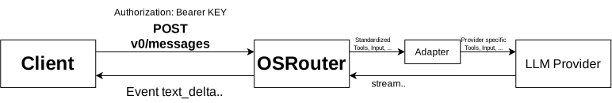

# OSRouter

## Description

OSRouter is a model/provider agnostic API endpoint.  

It standardizes inputs in custom types to maximize compatibility between providers.  

For me personally, it's a project to practice runtime typing with Zod and model-agnostic LLM handling logic.  

## Architecture



## Endpoints

### `GET /health`

Health check endpoint.

**Authentication:** Not required

**Request body:** None

**Response**

```json
{
  "status": "UP",
  "uptime_seconds": number
}
```

---

### `POST /v0/messages`

Sends a model-agnostic chat request to a supported provider and returns a Server-Sent Events stream.

**Authentication:** Required

```http
Authorization: Bearer <OSROUTER_API_KEY>
```

**Request body**

```ts
{
  provider: "openai" | "anthropic";

  model:
    | "gpt-5.6-sol"
    | "gpt-5.6-terra"
    | "gpt-5.6-luna"
    | "claude-haiku-4-5"
    | "claude-opus-5";

  input: ChatMessage[];

  tools: Tool[];
}
```

The selected `model` must belong to the selected `provider`.

Example:

```json
{
  "provider": "openai",
  "model": "gpt-5.6-sol",
  "input": [
    {
      "role": "user",
      "content": [
        {
          "type": "text",
          "text": "Hello!"
        }
      ]
    }
  ],
  "tools": []
}
```

### `ChatMessage`

```ts
type ChatMessage = {
  role: "system" | "developer" | "user" | "assistant";
  content: Content[];
};
```

### `Content`

Text content:

```ts
{
  type: "text";
  text: string;
}
```

Tool call:

```ts
{
  type: "tool_call";
  id: string;
  name: string;
  arguments: Record<string, unknown>;
}
```

Tool result:

```ts
{
  type: "tool_result";
  toolCallId: string;
  result: unknown;
  isError?: boolean;
}
```

### `Tool`

```ts
type Tool = {
  name: string;
  description?: string;

  parameters: {
    type: "object";
    properties: Record<string, unknown>;
    required: string[];
    additionalProperties: boolean;
  };
};
```

### Streaming response

`POST /v0/messages` responds using `text/event-stream`.

Each SSE message contains a normalized `AgentEvent`:

```text
data: {"type":"connected"}

data: {"type":"request_received"}

data: {"type":"text_delta","text":"Hello"}

data: {"type":"finish"}
```

Possible event types:

```ts
type AgentEvent =
  | { type: "connected" }
  | { type: "request_received" }
  | { type: "text_delta"; text: string }
  | {
      type: "tool_call";
      callId: string;
      name: string;
      arguments: string;
    }
  | { type: "thinking_start" }
  | { type: "thinking_end" }
  | { type: "finish" }
  | { type: "error"; error: string };
```

### Error responses

Before the SSE stream is opened, the endpoint may return a normal JSON error response.

```text
400 Bad Request
```

Invalid request body, provider, model, or provider/model combination.

```text
401 Unauthorized
```

Missing or invalid API key.

Once streaming has started, provider/runtime errors are sent as SSE events:

```json
{
  "type": "error",
  "error": "Error message"
}
```

## Related

[yuktn/mini-harness-codejam](https://github.com/yuktn/mini-harness-codejam)  

Mini-harness-codejam is a project for me to recreate a LLM harness from scratch.  
It will later implement OSRouter in its own logic.  

## AI Usage

I used AI in this project, specifically for repetitive work like type management and such, but not for core logics.

It's worth to note it since the objective of this project is to recreate AI routers from scratch and try new ways to implement or improve the logic used in them.  


v0.1.0